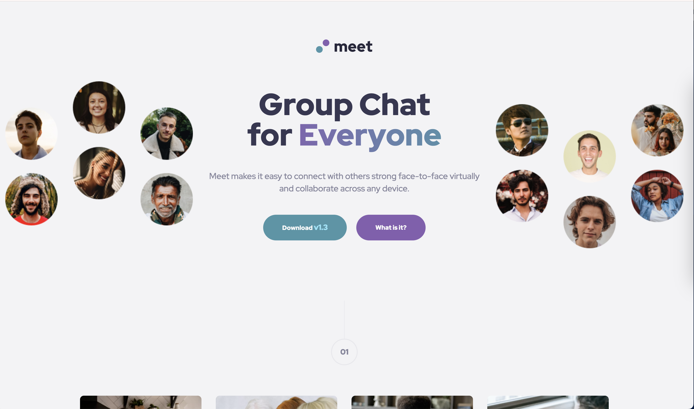
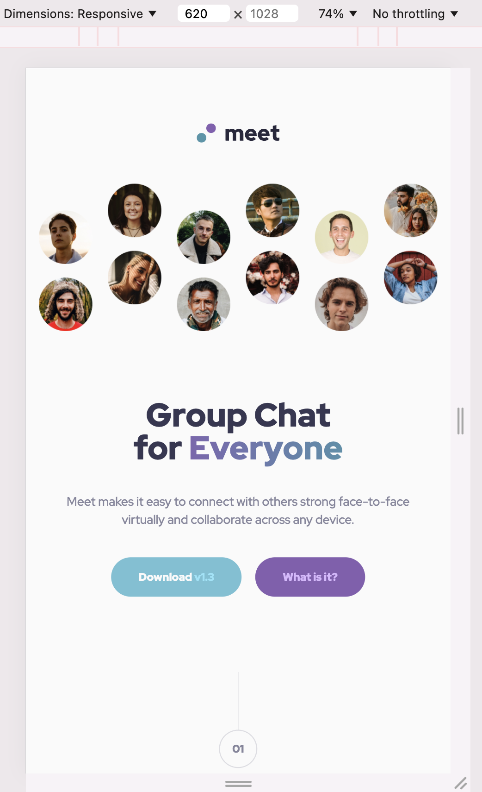
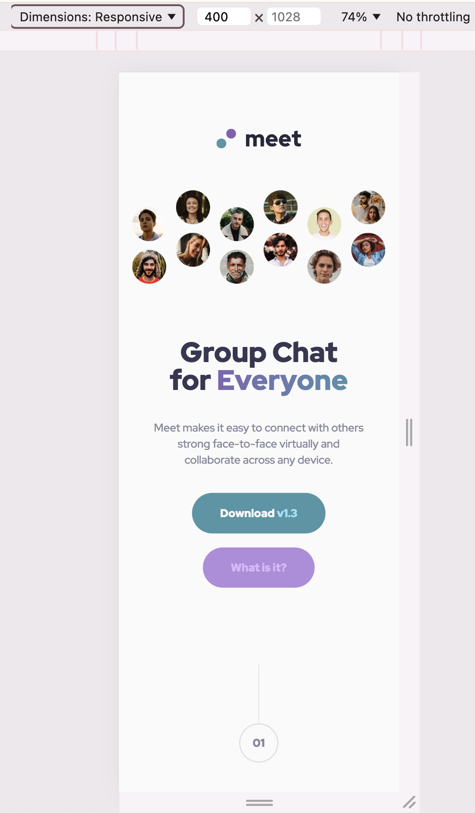

# Frontend Mentor - Meet landing page solution

## Welcome! 👋

This is a solution to the [Meet landing page challenge on Frontend Mentor](https://www.frontendmentor.io/challenges/meet-landing-page-rbTDS6OUR). Frontend Mentor challenges help you improve your coding skills by building realistic projects. 

## Table of contents

- [Overview](#overview)
  - [The challenge](#the-challenge)
  - [Screenshot](#screenshot)
  - [Links](#links)
  - [Resources](#resources)
- [Author](#author)

## Overview

### The challenge

Users should be able to:

- View the optimal layout depending on their device's screen size
- See hover states for interactive elements

### Screenshot

Tablet            |  Mobile
:-------------------------:|:-------------------------:
  |  

### Links

- [Live Site URL](https://sdkdeepa.github.io/meet-landing-page/))

### Resources
- https://stackoverflow.com/questions/4861224/how-to-use-css-to-surround-a-number-with-a-circle

## My process

### Built with
- Semantic HTML5 markup
- CSS custom properties
- Flexbox
- CSS Grid
- Mobile-first workflow

## Author
**Frontend Mentor - [@sdkdeepa](https://www.frontendmentor.io/profile/sdkdeepa)**

